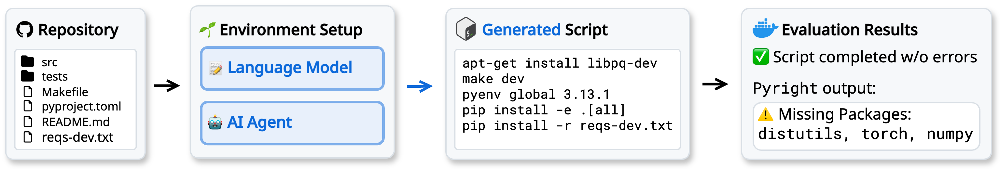

# 🌱⚙️ EnvBench
> *A benchmark for automated development environment setup*

<div align="center">
  
  <p><em>Overview of the EnvBench pipeline</em></p>
</div>

## 🔥 What's This?

EnvBench is a comprehensive benchmark for **automating environment setup** - an important task in software engineering. We have collected the largest dataset to date for this task and introduced a robust framework for developing and evaluating LLM-based agents that tackle environment setup challenges.

Our benchmark includes:
- 📊 **994 repositories**: 329 Python and 665 JVM-based (Java, Kotlin) projects
- 🧪 **Genuine configuration challenges**: Carefully selected repositories that cannot be configured with simple deterministic scripts
- 📈 **Evaluation metrics**: Static analysis for missing imports in Python and compilation checks for JVM languages
- 🤖 **Baselines**: Zero-shot baselines and agentic workflows tested with GPT-4o and GPT-4o-mini

Current state-of-the-art approaches achieve success rates of **6.69%** for Python and **29.47%** for JVM repositories, demonstrating that EnvBench presents significant challenges for existing methods and provides ample opportunity for future research.

## 🛠️ What You'll Need

- [uv](https://github.com/astral-sh/uv) - Modern Python package management
- [Docker](https://www.docker.com/) - For isolated environment execution

## 🏃‍♂️ Running the Benchmark

### 🔧 Setup

Create a virtual environment and install dependencies:

```bash
uv venv --python 3.12
source .venv/bin/activate
uv sync
# uv sync --extra dev  # optional

```
Set the required environment variables:

```bash
export HF_TOKEN=<your-huggingface-token>
export OPENAI_API_KEY=<your-openai-api-key>
# export WANDB_API_KEY=<your-wandb-api-key> # optional, wandb is disabled by default
# export DATA_ROOT=<path-to-your-data-root>  # optional, default is ./data
# export TEMP_DIR=<path-to-your-temp-dir>  # optional, default is ./tmp
```

### 🚂 Pipeline Execution

#### ✨ Quick Start

Execute the full pipeline (inference and evaluation):

```bash
uv run envbench -cn python-bash traj_repo_id=<your-hf-username>/<your-repo-name>
```

Results are automatically uploaded to your specified HuggingFace repository. Look at the [EnvBench-trajectories](https://huggingface.co/datasets/JetBrains-Research/EnvBench-trajectories/tree/main) dataset for the trajectories. Evaluation results are saved in the `results.jsonl` file.

#### 🎛️ Advanced Configuration

For additional configuration options, including different agents and language models, refer to the [conf](conf) directory with Hydra configurations.

Example: Running Zero-Shot GPT-4o on JVM data with W&B logging:

```bash
uv run envbench -cn jvm-zeroshot \
    llm@inference.agent=gpt-4o \
    traj_repo_id=<your-hf-username>/<your-repo-name> \
    use_wandb=true
```

#### 🧪 Evaluation

To run only the evaluation component:

```bash
uv run envbench -cn python-bash skip_inference=true skip_processing=true run_name=<your-run-name>
```

For more evaluation options, see [evaluation/main.py](evaluation/main.py).

## 🧩 Implementation Details

- 🤖 [Agents and Prompts](inference/src/agents) - Core reasoning components
- 🐳 [Dockerfiles](dockerfiles) - Environment containerization
- 📊 [Evaluation Scripts](evaluation/scripts) - Benchmark assessment

## 🏆 Resources

- 📦 [Dataset](https://huggingface.co/datasets/JetBrains-Research/EnvBench) - Benchmark dataset
- 📝 [Paper Trajectories](https://huggingface.co/datasets/JetBrains-Research/EnvBench-trajectories) - Agent trajectories from our paper

## 📚 Citation

If you find this work useful for your research, please use the following citation:

```
@inproceedings{
eliseeva2025envbench,
title={EnvBench: A Benchmark for Automated Environment Setup},
author={Aleksandra Eliseeva and Alexander Kovrigin and Ilia Kholkin and Egor Bogomolov and Yaroslav Zharov},
booktitle={ICLR 2025 Third Workshop on Deep Learning for Code},
year={2025},
url={https://openreview.net/forum?id=izy1oaAOeX}
}
```

## ⚖️ License

MIT. See `LICENSE` for details.